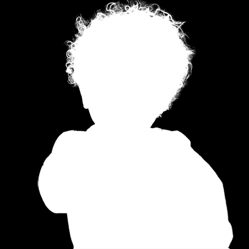
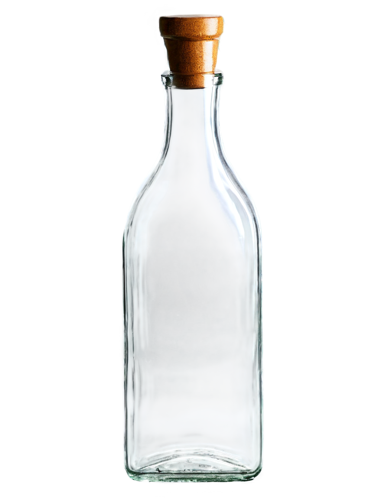
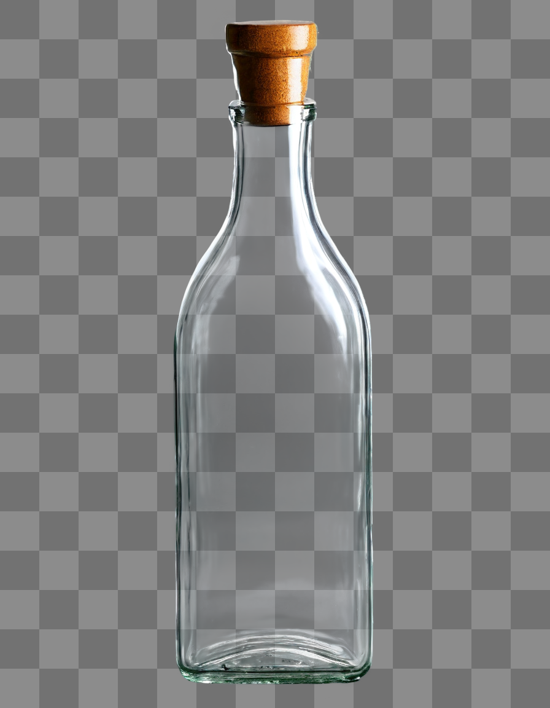
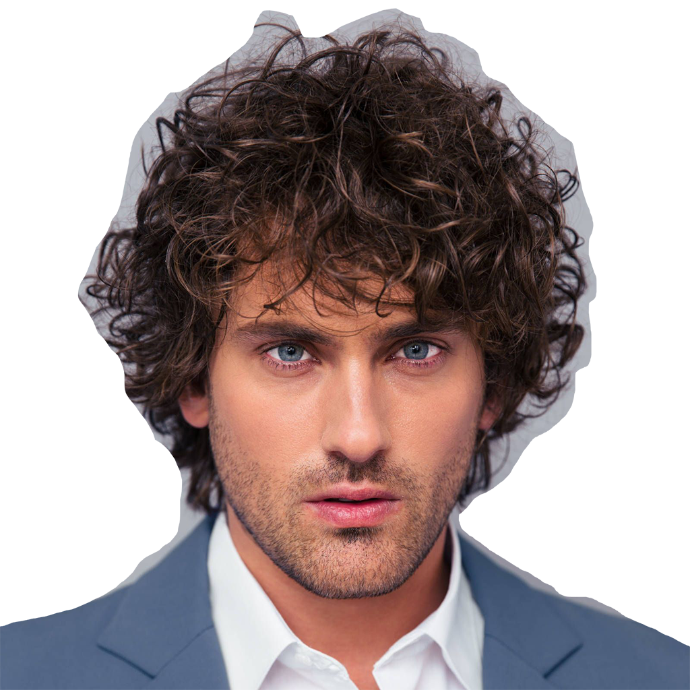
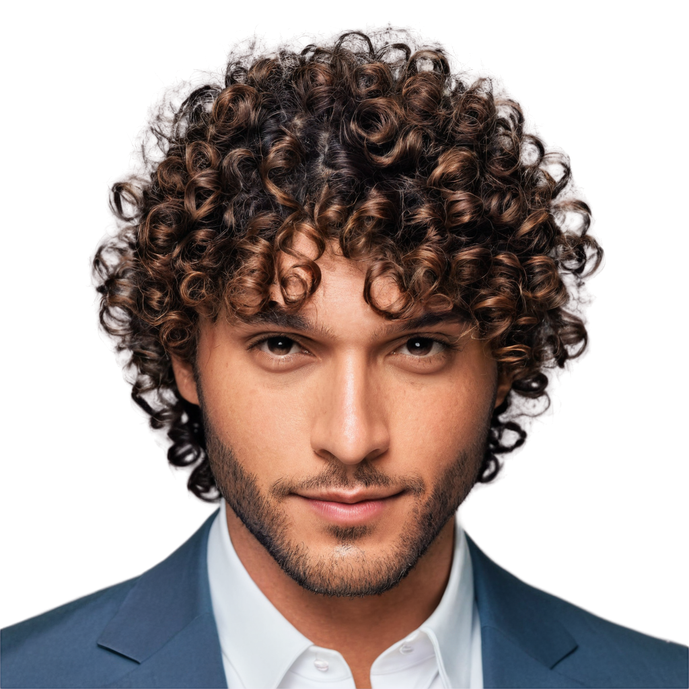
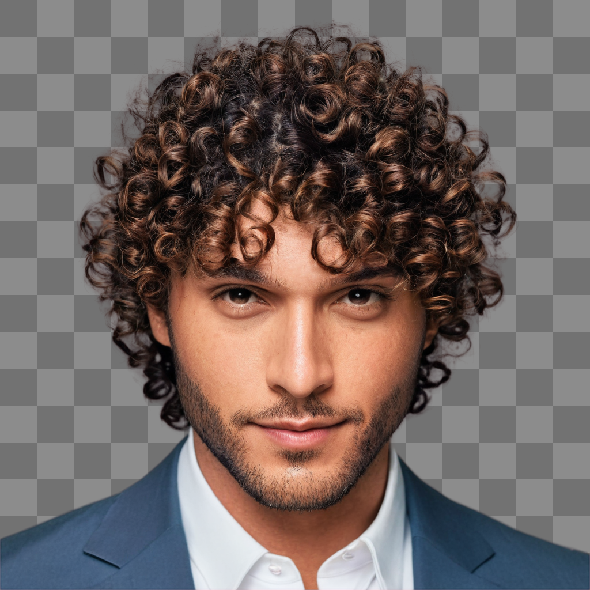

# LayerDiffuse Diffusers CLI

This repo is an official implementation of LayerDiffuse in pure diffusers without any GUI for easier development for different projects.

Note that this repo directly use k-diffusion to sample images (diffusers' scheduling system is not used) and one can expect SOTA sampling results directly in this repo without relying on other UIs.

Note that this project is a Work In Progress (WIP). We are going to port all features of LayerDiffuse (see also [sd-forge-layerdiffuse](https://github.com/layerdiffusion/sd-forge-layerdiffuse)).

# Get Started

You can use the below deployment:

    git clone https://github.com/lllyasviel/LayerDiffuse_DiffusersCLI.git
    cd LayerDiffuse_DiffusersCLI
    conda create -n layerdiffuse python=3.10
    conda activate layerdiffuse
    pip install torch torchvision --index-url https://download.pytorch.org/whl/cu121
    pip install -r requirements.txt

This repo has a simple memory management system, and you only need 8GB Nvidia VRAM.

Note that model downloads are automatic.

# CLI Tools

Below features are finished.

### RGB Padding

The algorithm to convert a transparent PNG image to a "padded" image with all invisible pixels filled with smooth, continues colors.

This padded RGB format is used for the training of all LayerDiffuse models.

```
python demo_rgb_padding.py
```

| Input                          | Input (Alpha)                     | Output                              |
|--------------------------------|-----------------------------------|-------------------------------------|
|  |  |  |

### SDXL Transparent T2I

Diffuse with transparency and decode the results.

```
python demo_sdxl_t2i.py
```

Prompt: "glass bottle, high quality"

| Output (Transparent image)                 | Output (Visualization with Checkerboard)     |
|--------------------------------------------|----------------------------------------------|
|  |  |

### SDXL Transparent I2I

Encode existing PNG images, diffuse, and decode results.

```
python demo_sdxl_i2i.py
```

Prompt: "a handsome man with curly hair, high quality"

Denoise: 0.7

| Input                              | Output (Transparent image)                 | Output (Visualization with Checkerboard)     |
|------------------------------------|--------------------------------------------|----------------------------------------------|
|  |  |  |

# TODO

The following features are going to be ported from [sd-forge-layerdiffuse](https://github.com/layerdiffusion/sd-forge-layerdiffuse) soon:

1. SD15 transparent t2i and i2i.
2. SDXL layer system.
3. SD15 layer system.
4. Add some possible applications using mask/inpaint.
